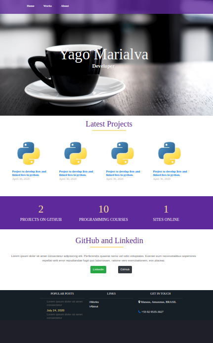
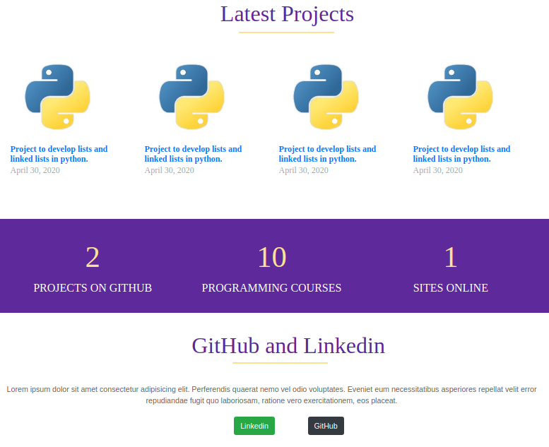
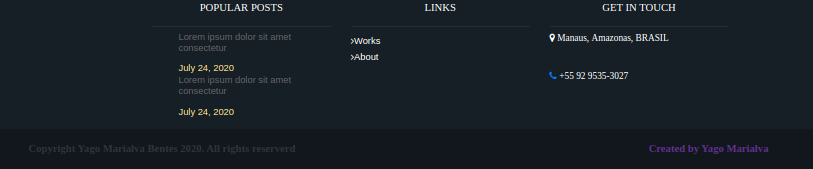

# Site-Portifolio
> Projeto desenvolvido para documentação e exibição de projetos criados por Yago Marialva Bentes.

O site-portifolio é uma projeto desenvolvido em html/css/javascript sem framework com o intuito de exibir os resultados de estudo de criação de páginas web e ser a primeira interação para futuros incrementos onde serão documentados os próximos projetos de estudos e de consulta como base para os mesmos.

## Instalação

Por ser um projeto que não utiliza as ferramentas mais complexas, como angular, react, só é necessário abrir o arquivo index.html no editor de texto desejado.

## Exemplo de uso

O site foi dividido em três partes numa única página, o header, o body e o footer.
O header é onde fica a barra de navegação, conforme imagem abaixo: 

Aqui é onde ficam os links para conhecer melhor sobre os projetos no github assim como o perfil para contato.

O body é onde ficam as principais informações sobre os mais recentes projetos.

Por fim, o footer é onde ficam as informações adicionais do desenvolvedor da página, assim como do projeto.

## Configuração para Desenvolvimento

As bibliotecas utilizadas estão na página "lib", o css, onde é desenvovido a parte gráfica do site está em "lib/css" e suas imagens estão em "lib/img".

## Histórico de lançamentos

* 0.0.1
    * Primeira interação do site

## Meta

Yago Marialva Bentes – yago.marialva@gmail.com

[https://github.com/yagomarialva](https://github.com/yagomarialva)

## Contributing

1. Faça o _fork_ do projeto (<https://github.com/yourname/yourproject/fork>)
2. Crie uma _branch_ para sua modificação (`git checkout -b feature/fooBar`)
3. Faça o _commit_ (`git commit -am 'Add some fooBar'`)
4. _Push_ (`git push origin feature/fooBar`)
5. Crie um novo _Pull Request_
